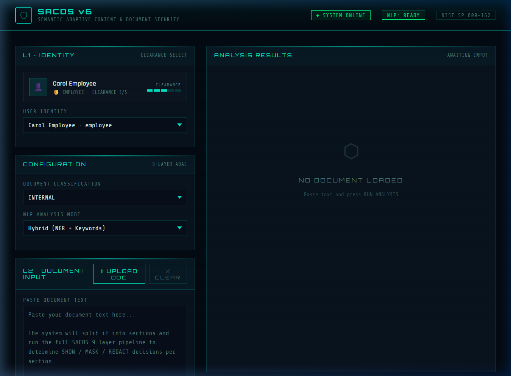

# SACDS v6 — Semantic Adaptive Content & Document Security

> **9-layer ABAC pipeline · NIST SP 800-162 · RL-Adaptive policies · 6-class schema**


A research-grade document security system that enforces **section-level access control** using NLP-based sensitivity scoring, role-based clearance, and reinforcement learning policy adaptation. Features full support for **PDF and DOCX document text extraction** and analysis.

Based on: *Karimi, L., Abdelhakim, M., & Joshi, J.B.D. (2021). arXiv:2105.08587*



---

## Architecture

```
Document Input
    │
    ▼
L1 Identity Layer          ← User authentication + role resolution
    │
    ▼
L2 Semantic Scorer         ← TF-IDF + Logistic Regression + spaCy NER + keywords
    │
    ▼
L3 Policy Context          ← NIST-aligned policy retrieval + signal extraction
    │
    ▼
L4 AB-SAC Decision Engine  ← SHOW / MASK / REDACT per section
    │
    ▼
L5 Entity Sanitizer        ← Named entity redaction + PII regex masking
    │
    ▼
L6 Audit Logger            ← SQLite audit trail with composite scores
    │
    ▼
L7 RL Policy Optimizer     ← Double-DQN agent with prioritised replay buffer
    │
    ▼
L8 Conflict Detector       ← Policy drift + escalation detection
    │
    ▼
L9 Research Metrics        ← Precision / Recall / F1 / AUC-ROC / Leakage Rate
```

## Sensitivity Labels (6-class schema)

| Label         | Level | Description |
|---------------|-------|-------------|
| PUBLIC        | 0     | Unrestricted content |
| CONFIDENTIAL  | 2     | Internal business data (absorbs RESTRICTED) |
| LEGAL         | 2     | Attorney-client, litigation content |
| FINANCIAL     | 3     | Revenue, payroll, balance sheet data |
| PII           | 4     | Personal identifiers, SSN, medical records |
| TOP_SECRET    | 5     | Classified/compartmented content |

## Role Clearance Matrix

| Role     | Clearance | Access |
|----------|-----------|--------|
| admin    | 5/5       | All labels |
| manager  | 4/5       | Up to FINANCIAL |
| employee | 3/5       | PUBLIC + CONFIDENTIAL |
| auditor  | 2/5       | PUBLIC + CONFIDENTIAL + FINANCIAL |
| intern   | 1/5       | PUBLIC only |

---

## Quick Start

### 1. Install dependencies

```bash
pip install -r requirements.txt
python -m spacy download en_core_web_sm
```

### 2. Run the web app

```bash
python app.py
```

Open **http://localhost:5000** in your browser.

### 3. Or use the notebook

Open `SACDS_v6_Final.ipynb` in Jupyter for the full research pipeline including ML training, RL optimization, and evaluation metrics.

---

## REST API

### POST `/api/analyze`

Analyze a document through the full SACDS pipeline.

```json
{
  "text":      "Your document text here...",
  "user_id":   "carol_employee",
  "doc_class": "internal",
  "nlp_mode":  "hybrid"
}
```

**Parameters:**
- `user_id`: `alice_admin` | `bob_manager` | `carol_employee` | `dave_auditor` | `eve_intern`
- `doc_class`: `public` | `internal` | `confidential` | `restricted` | `secret`
- `nlp_mode`: `hybrid` | `keyword_only` | `ner`

**Response:**
```json
{
  "user": { "name": "Carol Employee", "role": "employee", "clearance": 3 },
  "sections": [
    {
      "section_id": 0,
      "decision": "SHOW",
      "top_label": "PUBLIC",
      "sensitivity_score": 0,
      "display_text": "...",
      "reason": "Public content — unrestricted",
      "policy_signal": "NEUTRAL"
    }
  ],
  "summary": { "total_sections": 3, "show": 2, "mask": 1, "redact": 0 }
}
```

### GET `/api/users`
Returns all user personas with role and clearance level.

### GET `/api/policies`
Returns the full role → policy mapping.

### GET `/api/sample-texts`
Returns 3 sample documents for quick testing.

### POST `/api/extract-text`
Accepts a `multipart/form-data` upload of a `.txt`, `.pdf`, or `.docx` file and returns the extracted raw text for use in the analysis pipeline.

---

## Project Structure

```
sacds-v6/
├── app.py                     # Flask REST API + frontend server
├── sacds/
│   ├── __init__.py
│   └── engine.py              # Core 9-layer pipeline
├── templates/
│   └── index.html             # Web frontend
├── requirements.txt
├── README.md
└── SACDS_v6_Final.ipynb       # Original research notebook
```

---

## v6 Improvements over v4

| Improvement | Detail |
|-------------|--------|
| 6-class label schema | RESTRICTED merged into CONFIDENTIAL (+3–5% Macro-F1) |
| ML Classifier in L2 | TF-IDF (word+char n-gram) + Logistic Regression with GridSearchCV |
| Sentence-Transformer embeddings | `all-MiniLM-L6-v2` with graceful TF-IDF fallback |
| Soft-voting ensemble | ML probability + keyword signal + NER label (weighted) |
| Fixed L4 gap override | Gap adjusts confidence, never overrides correct ML label |
| Expanded keywords | PII regex (SSN, email, phone, DOB), LEGAL compliance, GDPR |
| RL extended to 300 epochs | 5× minority-class reward multiplier + ML confidence state |

---

## Citation

```bibtex
@misc{karimi2021sacds,
  title  = {Semantic Adaptive Content & Document Security},
  author = {Karimi, L. and Abdelhakim, M. and Joshi, J.B.D.},
  year   = {2021},
  url    = {https://arxiv.org/abs/2105.08587}
}
```

---

## License

MIT — see [LICENSE](LICENSE) for details.
